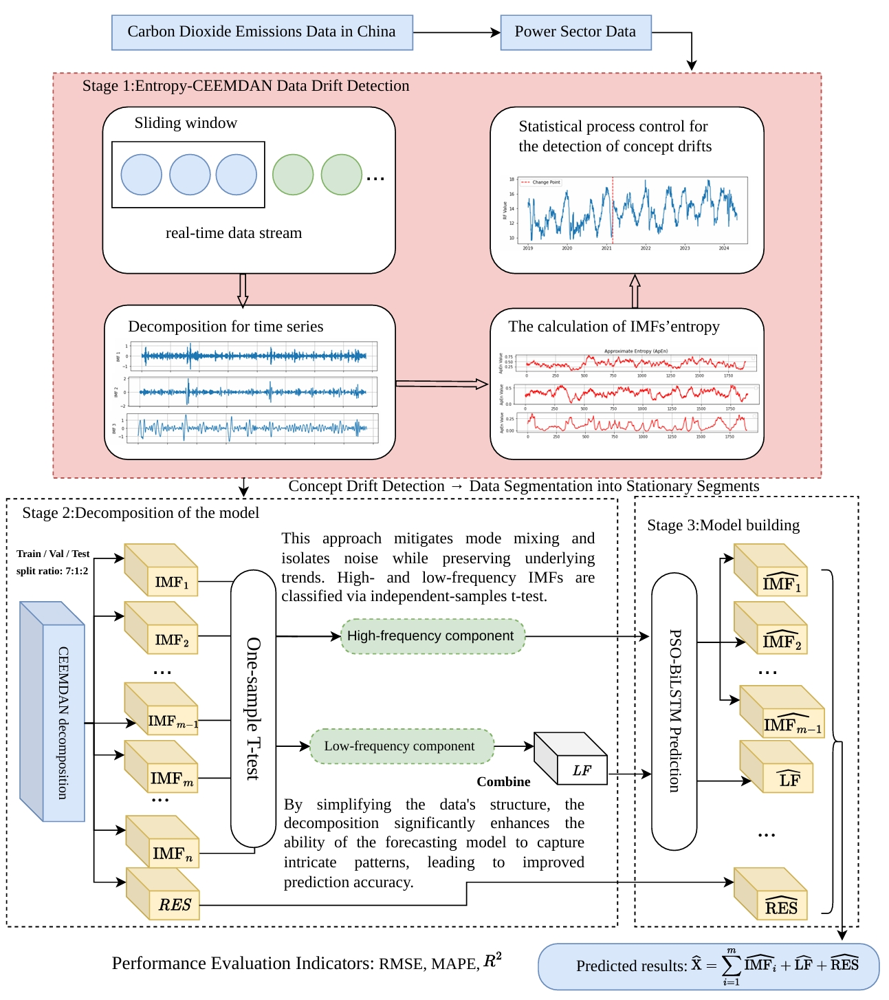

# An Entropy-Driven Drift Detection and Feature-Optimized Framework for Robust Carbon Emission Forecasting in the Power Sector

This repository provides a reproducible PyTorch implementation for the paper:

**An entropy-driven drift detection and feature-optimized framework for robust carbon emission forecasting in the power sector**

The project implements the full forecasting pipeline proposed in the manuscript, including entropy-enhanced concept drift detection, CEEMDAN decomposition, particle swarm optimization, bidirectional recurrent forecasting, ablation studies, baseline comparisons, statistical tests, and computational complexity analysis. The revised manuscript experiments use Python 3.9 and PyTorch 2.5.1.

## Overview

Daily carbon emission series are non-stationary, nonlinear, and affected by local structural shifts. This repository follows a drift-aware multi-stage workflow:

1. Detect distribution drift with Entropy-CEEMDAN Data Drift Detection (ECDDD).
2. Decompose emission series with Complete Ensemble Empirical Mode Decomposition with Adaptive Noise (CEEMDAN).
3. Classify intrinsic mode functions (IMFs) into high-frequency and low-frequency components using a one-sample t-test.
4. Forecast decomposed components with BiLSTM and PSO-optimized BiLSTM models.
5. Compare against the manuscript baselines and SOTA forecasters: LSTM, BiLSTM, DLinear, iTransformer, and MLP-Mixer.

The overall workflow used in the revised manuscript is shown below.



## Repository Structure

```text
ECDDD-Carbon-Forecasting/
├── config.yaml
├── requirements.txt
├── docs/
│   └── figures/
│       └── framework.png
├── data/
│   ├── raw/CM_emission_kton.csv
│   ├── synthetic/
│   ├── data_loader.py
│   └── synthetic_data.py
├── models/
│   ├── drift_detection.py
│   ├── ceemdan.py
│   ├── pso_optimizer.py
│   ├── backbones.py
│   └── ensemble.py
├── utils/
│   ├── metrics.py
│   ├── complexity.py
│   ├── plot.py
│   └── common.py
├── experiments/
│   ├── run_drift.py
│   ├── run_forecast.py
│   ├── run_ablation.py
│   └── run_complexity.py
├── notebooks/result_analysis.ipynb
└── outputs/
```

## Dataset

The empirical experiments use the public daily carbon emission dataset released by the **Carbon Monitor** project:

- Source: https://carbonmonitor.org.cn/
- File used in this repository: `data/raw/CM_emission_kton.csv`
- Format: long-table CSV with columns `date`, `sector`, `country`, and `co2`
- Default subset: `country = China`, `sector = Power`
- Period used in the manuscript: January 1, 2019 to April 30, 2024

The default configuration also includes the Power-sector drift-based manuscript segments:

```text
Unsegmented: 2019-01-01 to 2024-04-30
Segment 1:   2019-01-01 to 2021-03-01
Segment 2:   2021-03-02 to 2024-04-30
```

All forecasting experiments use strict chronological splitting to avoid future leakage. The revised manuscript protocol is 7:1:2: the first 70% of each dataset is used for training, the next 10% for validation and hyperparameter tuning, and the final 20% for held-out testing.

## Installation

Create a clean Python environment:

```bash
python -m venv .venv
source .venv/bin/activate
python -m pip install --upgrade pip
python -m pip install -r requirements.txt
```

For CUDA-enabled servers, install the PyTorch build matching your CUDA version first, then install the remaining dependencies:

```bash
python -m pip install -r requirements.txt
```

## Configuration

All experiment settings are centralized in `config.yaml`.

Important options:

- `data.csv_path`: path to the Carbon Monitor CSV file
- `data.country` and `data.sector`: empirical subset selection
- `data.window_size`: rolling input length, default `5`
- `data.train_ratio`, `data.validation_ratio`, and `data.test_ratio`: chronological 7:1:2 split used by the revised manuscript
- `drift_detection.ecddd`: ECDDD window size, threshold, and CEEMDAN settings
- `ceemdan.trials`: CEEMDAN ensemble iterations, manuscript default `1000`
- `ceemdan.forecasting_protocol`: default `causal_expanding`, which avoids future leakage by decomposing only observations available at each forecast origin. Set `full_series` only when reproducing legacy whole-series CEEMDAN tables.
- `pso`: manuscript PSO settings, including population size `50`, max iterations `30`, and the BiLSTM hidden-unit search space
- `model_overrides`: model-specific tuned values corresponding to the manuscript hyperparameter table
- `baselines`: models included in the forecasting comparison
- `complexity`: training-time, inference-time, and memory profiling settings

## Experiments

Run a quick smoke test before launching full experiments:

```bash
python -m experiments.run_forecast --quick --models dlinear itransformer mlp_mixer
```

Run drift detection experiments:

```bash
python -m experiments.run_drift
```

Run the main forecasting experiments and baseline comparisons:

```bash
python -m experiments.run_forecast
```

Run ablation and hyperparameter sensitivity studies:

```bash
python -m experiments.run_ablation
```

Run computational complexity evaluation:

```bash
python -m experiments.run_complexity
```

## Implemented Models

Proposed and manuscript models:

- ECDDD-CEEMDAN-PSO-BiLSTM
- CEEMDAN-PSO-BiLSTM
- CEEMDAN-BiLSTM
- PSO-BiLSTM
- BiLSTM
- LSTM

SOTA comparison baselines used in the revised manuscript:

- DLinear
- iTransformer
- MLP-Mixer

## Outputs

Experiment outputs are written to `outputs/results/` and `outputs/figures/`.

Key result files:

- `drift_detection_summary.csv`: synthetic drift detection benchmark summary
- `sector_drift_points.csv`: detected drift points for configured sectors
- `forecast_metrics.csv`: forecasting metrics for all datasets and models
- `forecast_metrics_manuscript_format.csv`: table-ready metrics with directional arrows
- `forecast_metrics_manuscript_table.md`: Markdown table with best values highlighted
- `forecast_predictions.csv`: long-format test predictions with `Dataset`, `Model`, `Step`, `Target Index`, `Actual`, and `Prediction`
- `dataset_partition_summary.csv`: chronological train, validation, and test split details
- `hyperparameter_protocol.json`: default hyperparameters and tuning protocol
- `pso_best_params.json`: selected PSO parameters
- `wilcoxon_tests.csv`: pair-wise statistical comparison results
- `friedman_test.csv`: global statistical comparison across models
- `ablation_results.csv`: component ablation results by manuscript data setting
- `sensitivity_ecddd_window_size.csv`: ECDDD sliding-window sensitivity analysis by manuscript data setting
- `sensitivity_num_layers.csv`: BiLSTM-layer sensitivity analysis by manuscript data setting
- `complexity_results.csv`: `Parameters (M)`, `Training Time (s)`, `Inference Time (ms/seq)`, and `GPU Memory (GB)`

## Reproducibility Notes

The implementation fixes random seeds for Python, NumPy, and PyTorch when possible. Neural models are trained with chronological splits and early stopping. PSO uses only the validation period for hyperparameter fitness, and final test metrics are computed once on the held-out test period.

For CEEMDAN-based forecasting, the default `causal_expanding` protocol performs train/validation decomposition only on the train/validation observation span. During testing, each forecast origin is decomposed with an expanding history that ends before the forecast target. This is slower than whole-series decomposition but aligns with the repository's leakage-avoidance protocol. The `full_series` protocol is retained only for reproducing older manuscript tables that decomposed the entire dataset at once.

Complexity reports measure the elapsed training pipeline time, fitted-model parameter count, inference time, and GPU memory using the manuscript batch size of 32 by default. For hybrid models, the training-time measurement includes the configured decomposition, drift-detection, and PSO stages that are part of the manuscript framework.

CEEMDAN uses `EMD-signal` when available. A deterministic multi-scale fallback is included only to keep lightweight smoke tests executable in minimal environments; paper-level experiments should use the CEEMDAN implementation from `EMD-signal`.

## Citation

If you use this repository, please cite the paper:

```bibtex
@article{dong2026ecddd,
  title = {An entropy-driven drift detection and feature-optimized framework for robust carbon emission forecasting in the power sector},
  author = {Dong, Wei and Che, Jinxing and Mohd Ariff, Noratiqah and Abu Bakar, Mohd Aftar and Lee, Bernard Kok Bang},
  year = {2026}
}
```

## Acknowledgement

The carbon emission data used in this project are provided by Carbon Monitor. Please refer to the Carbon Monitor website for data access terms and updates.
